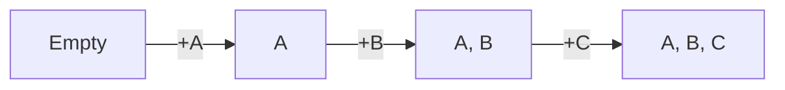
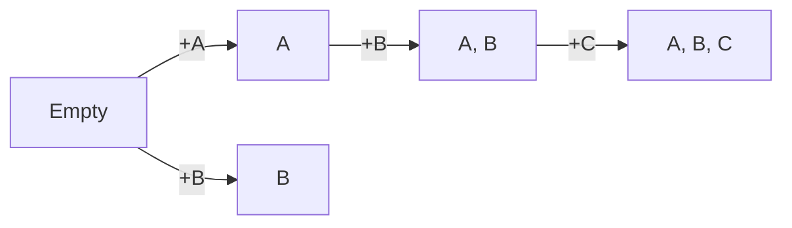
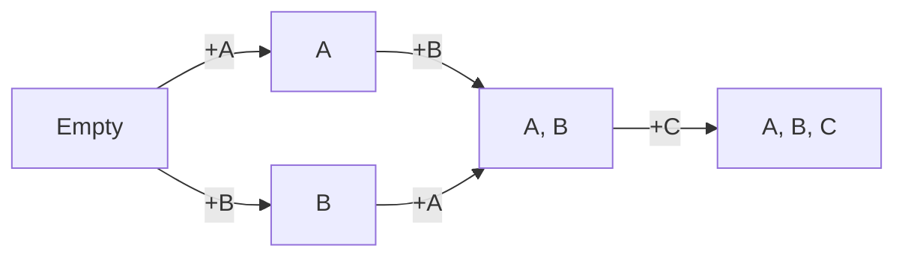

# Archetype Graph

> This method of archetype storage is heavily inspired by [Flecs' archetype graph](https://ajmmertens.medium.com/building-an-ecs-2-archetypes-and-vectorization-fe21690805f9). Their article goes into more detail on performance considerations and implementation.

{style="note"}

Since our engine groups entities by archetypes, adding or removing components requires us to move entities from one archetype to another. To add/remove a component, remove the entity from its current archetype, find the right one to jump to, and add it to that archetype.

This page explores how we can quickly figure out the correct archetype to jump to for better performance.

## A simple graph

Consider a graph where each node is an archetype and each edge represents a component addition. We build this graph by adding components `A, B, C` in order:

A new entity gets added to the `Empty` archetype, then adding `A` leads us to archetype `[A]`, adding `B` leads us to archetype `[A, B]`, etc...

## Avoiding duplicates

However, if we are not careful about the order we add components in, we may end up with useless branches. For instance, adding `C, B, A` is identical to adding `A, B, C`; we should end up at the same archetype.

We can order components by their component id to avoid this problem. However, we don't usually add all our components at once, so we can't sort them ahead of time. Consider a new entity where we skip adding `A`, and add `B` instead. This is a valid operation and leads us to a unique arechetype:

What connection should we make if this new entity later adds `A`? Clearly we want it to go to archetype `[A, B]`, as its components are sorted correctly:

Programmatically, to find the right archetype to jump to, we go all the way back to `Empty` and add all our components (including the new one) in order, then memorize the archetype we jumped to, so we get to it faster in the future.

Always going from the start and adding in order ensures we will reuse as many paths as we can, and that all archetypes are unique (pause and convince yourself why.)

### Removing components

We can easily support component removal by doing the same process, but removing a component from our list when traversing from `Empty`.

## Creating new archetypes

We can now safely integrate this system with one that creates new archetypes as needed, automatically building out the graph as we add new entities and components!

## Ups and downs

The archetype graph lets us very quickly figure out how to navigate across archetypes by caching transitions. The downside is that we end up with a trail of empty archetypes that we'll forever have to deal with, as well as more memory used per archetype to remember transitions.

However, this extra memory usage should generally be quite small compared to the actual data stored on entities: A bigger graph implies more data stored per entity.

In general, I've decided to treat the graph, and archetypes themselves as a caching layer. In some applications it may be worth writing a garbage collector, or perhaps something that puts archetypes to "sleep" for system iteration, but in a big application like a game, the graph should eventually reach a steady size as most game actions become seen and start to repeat.
